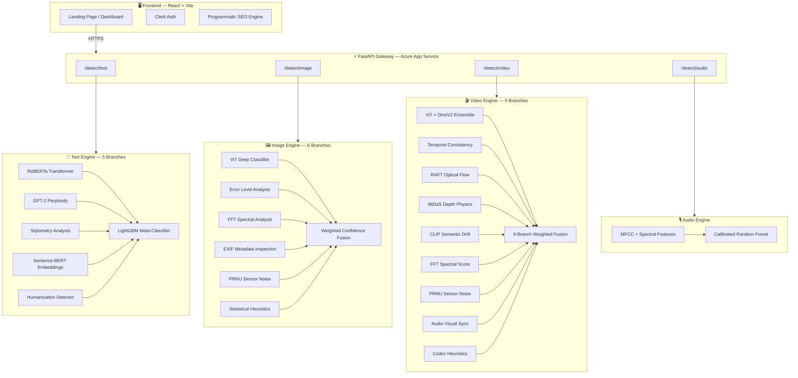

<div align="center">

# 🔍 DetectAi

### The Human Standard

**Enterprise-grade, multi-modal AI content detection engine.**
**Catch ChatGPT essays, Midjourney images, Sora deepfakes, and ElevenLabs voice clones — all in one platform.**

[](https://dtectai.tech)
[](https://detectai-api-fsftcaf4hyfqhqfc.koreacentral-01.azurewebsites.net/docs)
[](LICENSE)
[](https://python.org)
[](https://react.dev)

</div>

---

## 🎯 The Problem

AI-generated content is everywhere — and existing detection tools are fragmented. Teachers juggle separate tools for text, images, and video. Students get falsely flagged. Deepfakes go undetected. **There is no single platform that handles all modalities.**

**DetectAi** solves this with a unified, multi-modal detection engine that analyzes text, images, video, and audio through a single API and dashboard.

---

## 🏗️ Architecture

DetectAi uses a **Branch-and-Fuse** architecture. Each media type is processed through an independent pipeline composed of specialized analysis branches. Branch outputs are fused into a single, calibrated confidence score.



> 📖 **Deep dive:** See [docs/architecture.md](docs/architecture.md) for full technical details on each branch.

---

## ✨ Features

| Feature | Description |
|---------|-------------|
| 🔤 **Text Detection** | 5-branch ensemble (RoBERTa, perplexity, stylometry, embeddings, humanization) with LightGBM meta-classifier and per-sentence explainability |
| 🖼️ **Image Detection** | 6-branch fusion (ViT, ELA, FFT, EXIF, PRNU, heuristics) with perceptual hash caching |
| 🎬 **Video Detection** | 9-branch fusion (ViT, DinoV2, RAFT optical flow, MiDaS depth, CLIP semantic drift, temporal analysis) |
| 🎙️ **Audio Detection** | Spectral feature extraction + calibrated Random Forest for voice clone detection |
| 📊 **Dashboard** | Real-time scan results, history tracking, analytics charts |
| 🔐 **Authentication** | Clerk-powered OAuth with SSO support |
| 🌗 **Dark Mode** | Full dark/light theme support with smooth transitions |
| 🔍 **SEO Engine** | Programmatic long-tail SEO with Schema.org structured data and auto-generated sitemap |

---

## 🛠️ Tech Stack

| Layer | Technology |
|-------|-----------|
| **Frontend** | React 19, Vite, Framer Motion, Recharts |
| **Auth** | Clerk |
| **Backend** | FastAPI, Python 3.11, Uvicorn |
| **ML Models** | PyTorch, HuggingFace Transformers (ViT, RoBERTa, DinoV2, RAFT, MiDaS, GPT-2) |
| **Ensemble** | LightGBM, scikit-learn (isotonic calibration) |
| **Task Queue** | Celery + Redis |
| **Database** | SQLite |
| **Hosting** | Azure App Service (B3), Vercel |
| **CI/CD** | GitHub Actions → Azure auto-deploy |
| **Analytics** | Vercel Web Analytics |

---

## 📁 Project Structure

```
detectai/
├── backend/                    # FastAPI application
│   ├── main.py                 # App entrypoint & router registration
│   ├── text/                   # Text detection module
│   │   ├── router.py           # /detect/text endpoint
│   │   ├── engines/            # 5 detection branches
│   │   │   ├── transformer.py  #   └─ RoBERTa classifier
│   │   │   ├── perplexity.py   #   └─ GPT-2 perplexity scorer
│   │   │   ├── stylometry.py   #   └─ Statistical text analysis
│   │   │   ├── embeddings.py   #   └─ Sentence-BERT similarity
│   │   │   └── humanization.py #   └─ Paraphrase detector
│   │   ├── ensemble/           # Meta-classifier & calibration
│   │   ├── explainability/     # Per-sentence attribution
│   │   ├── preprocessors/      # Chunking & language detection
│   │   └── models/             # Serialized model artifacts
│   ├── image/                  # Image detection module
│   │   ├── router.py           # /detect/image endpoint
│   │   ├── fusion.py           # Weighted branch fusion
│   │   ├── tasks.py            # Celery async tasks
│   │   └── branches/           # 6 detection branches
│   │       ├── deep_classifier.py  # ViT classifier
│   │       ├── ela.py              # Error Level Analysis
│   │       ├── fft_cnn.py          # FFT spectral analysis
│   │       ├── metadata.py         # EXIF inspection
│   │       ├── prnu_residual.py    # Sensor noise analysis
│   │       └── advanced_heuristics.py
│   ├── video/                  # Video detection module
│   │   ├── router.py           # /detect/video endpoint
│   │   └── branches/           # 9 detection branches
│   │       ├── vit_ensemble.py     # ViT + DinoV2
│   │       ├── temporal_consistency.py
│   │       ├── motion_physics.py   # RAFT optical flow
│   │       ├── depth_physics.py    # MiDaS depth estimation
│   │       ├── semantic_drift.py   # CLIP embeddings
│   │       ├── fft_score.py
│   │       ├── prnu_score.py
│   │       ├── audio_physics.py
│   │       └── advanced_heuristics.py
│   ├── audio/                  # Audio detection module
│   │   ├── router.py           # /detect/audio endpoint
│   │   └── tasks.py            # Feature extraction & classification
│   ├── database.py             # SQLite connection manager
│   ├── history.py              # Scan history CRUD
│   ├── models.py               # Pydantic schemas
│   ├── celery_app.py           # Task queue config
│   ├── Dockerfile              # Container build
│   └── requirements.txt        # Python dependencies
├── frontend/                   # React SPA
│   ├── src/
│   │   ├── App.jsx             # Router & providers
│   │   ├── pages/              # Page components
│   │   ├── components/         # Shared UI components
│   │   ├── config/seoConfig.js # Programmatic SEO configuration
│   │   ├── context/            # Theme provider
│   │   └── lib/                # Utility functions
│   ├── public/                 # Static assets, sitemap, robots.txt
│   ├── index.html              # HTML entry point
│   └── vite.config.js          # Vite build configuration
├── docs/                       # Technical documentation
│   ├── architecture.md         # System architecture deep-dive
│   ├── api_reference.md        # API endpoint reference
│   └── text_engine_architecture.md
├── .github/workflows/          # CI/CD pipelines
│   └── azure-deploy.yml        # Auto-deploy to Azure on push
├── .gitignore
├── CONTRIBUTING.md
├── LICENSE                     # MIT License
└── README.md                   # ← You are here
```

---

## 🚀 Getting Started

### Prerequisites

- Python 3.11+
- Node.js 18+
- Git

### 1. Clone the Repository

```bash
git clone https://github.com/Harsh2o/detectai.git
cd detectai
```

### 2. Backend Setup

```bash
cd backend
python -m venv venv
source venv/bin/activate        # Windows: venv\Scripts\activate
pip install -r requirements.txt
cp .env.example .env            # Add your HuggingFace token
uvicorn main:app --reload --host 0.0.0.0 --port 8000
```

The API will be live at `http://localhost:8000/docs`

### 3. Frontend Setup

```bash
cd frontend
npm install
cp .env.example .env.local      # Configure API URL & Clerk keys
npm run dev
```

The app will be live at `http://localhost:5173`

---

## 🌐 Deployment

### Backend → Azure App Service

The backend auto-deploys via GitHub Actions. Every push to `main` triggers the workflow in `.github/workflows/azure-deploy.yml`.

```yaml
# Deploys to: https://detectai-api-xxxxx.azurewebsites.net
```

### Frontend → Vercel

The frontend auto-deploys via Vercel's GitHub integration. Connect your repo in the Vercel dashboard and set the following environment variables:

| Variable | Value |
|----------|-------|
| `VITE_API_URL` | Your Azure backend URL |
| `VITE_CLERK_PUBLISHABLE_KEY` | Your Clerk publishable key |

---

## 📖 Documentation

| Document | Description |
|----------|-------------|
| [Architecture](docs/architecture.md) | Full system architecture, engine details, and infrastructure |
| [API Reference](docs/api_reference.md) | Complete REST API endpoint documentation |
| [Text Engine](docs/text_engine_architecture.md) | Deep-dive into the text detection pipeline |
| [Contributing](CONTRIBUTING.md) | Development setup and contribution guidelines |

---

## 📄 License

This project is licensed under **All Rights Reserved** — see the [LICENSE](LICENSE) file for details. You may view this code for educational purposes, but copying, deploying, or modifying it is strictly prohibited.

---

<div align="center">

**Built with ❤️ by [Harsh Gupta](https://github.com/Harsh2o)**

[Live Demo](https://dtectai.tech) · [API Docs](https://detectai-api-fsftcaf4hyfqhqfc.koreacentral-01.azurewebsites.net/docs) · [Report Bug](https://github.com/Harsh2o/detectai/issues) · [Request Feature](https://github.com/Harsh2o/detectai/issues)

</div>
